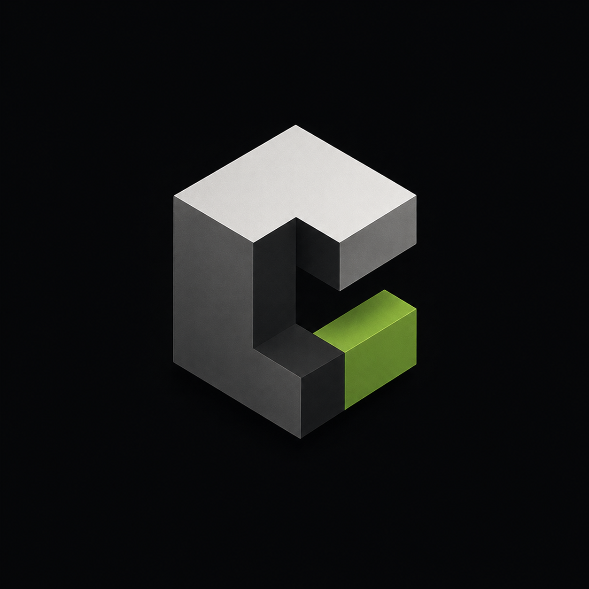

<p align="center">
  
</p>

# Cubit

Cubit is a custom C++ engine project with a sandbox application used to test engine features as they are built. The long-term design target is an Ace of Spades style multiplayer voxel FPS: destructible block terrain, building, shooting, team-based match rules, and networked multiplayer.

The repository is intentionally split into an engine DLL and a small sandbox executable. The engine lives in `Cubit`, while `Sandbox` is the current executable used to load and exercise engine code.

## Current Status

Cubit is in the foundation stage. The current implementation includes:

- A GLFW-backed window, OpenGL context, application loop, and frame timestep.
- Routed window, keyboard, and mouse events plus polled input.
- Layer and overlay routing alongside a typed gameplay event bus.
- OpenGL vertex arrays, vertex and index buffers, shaders, and indexed drawing.
- Scene submission with per-object transforms.
- Orthographic and perspective cameras with resize-aware controllers.
- A sandbox scene that renders a colored indexed cube with depth testing.
- Premake-generated Visual Studio projects for the engine DLL and sandbox executable.

In the sandbox, use `W`, `A`, `S`, and `D` to move, `Space` and left `Shift` to
move vertically, and move the captured mouse to look around. The cube demonstrates
indexed 3D geometry, interleaved position and color
attributes, model transforms, perspective projection, and depth testing.

Most systems described in the design document are planned scope, not implemented scope yet.

## Project Goal

The design target is a playable prototype first, then a vertical slice. The intended game loop is:

- Move around a voxel map.
- Shoot other players.
- Dig or destroy terrain.
- Place blocks to build cover or routes.
- Respawn and continue in a team-based match.
- Synchronize players, combat, and terrain edits over the network.

The guiding rule from the project documentation is: build only what the game needs. Each engine subsystem should be testable in the sandbox before it is relied on by the game layer.

## Repository Layout

```text
Cubit/
+-- Cubit/                  Engine project
|   +-- include/
|   |   +-- Cubit/          Public API headers used by client code
|   |       +-- Application.h
|   |       +-- Core.h
|   |       +-- Cubit.h
|   |       +-- Logger.h
|   +-- src/
|       +-- Core/           Engine-only internal code
|       |   +-- CoreLogger.cpp
|       |   +-- CoreLogger.h
|       +-- Application.cpp
|       +-- Logger.cpp
+-- Sandbox/                Test executable / startup project
|   +-- src/
|       +-- Sandbox.cpp
+-- Documentation/
|   +-- Cubit.pdf           Project scope and feature specification
+-- images/
|   +-- CubitLogo.png
+-- GenerateProjects.bat    Regenerates Visual Studio files with Premake
+-- premake5.lua            Build configuration
+-- README.md
```

Generated folders such as `bin/`, `bin-int/`, and Visual Studio project files are build artifacts produced by Premake and MSBuild.

## Build Requirements

- Windows
- Visual Studio 2026 or a compatible Visual Studio C++ toolchain
- Premake 5 available on `PATH`
- C++20 compiler support

## Generating Projects

Run:

```bat
GenerateProjects.bat
```

This removes old build output and solution files, then runs:

```bat
premake5 vs2026
```

After generation, open:

```text
Cubit.sln
```

The solution start project is `Sandbox`.

## Building and Running

1. Generate the project files.
2. Open `Cubit.sln` in Visual Studio.
3. Select the `Debug` configuration and `x64` platform.
4. Build the solution.
5. Run `Sandbox`.

The expected output binary layout is:

```text
bin/
+-- Debug-windows-x86_64/
    +-- Cubit/
    |   +-- Cubit.dll
    |   +-- Cubit.lib
    +-- Sandbox/
        +-- Sandbox.exe
        +-- Cubit.dll
```

`Cubit.dll` is copied into the `Sandbox` output directory after `Sandbox` builds so the executable can load the engine DLL at runtime.

## Architecture

### Cubit

`Cubit` is the engine library. It currently builds as a Windows DLL and exports public engine symbols through `CB_API`:

```cpp
#ifdef CB_PLATFORM_WINDOWS
    #ifdef CB_BUILD_DLL
        #define CB_API __declspec(dllexport)
    #else
        #define CB_API __declspec(dllimport)
    #endif
#else
    #define CB_API
#endif
```

Public headers live under `Cubit/include/Cubit`. Private engine-only code lives under `Cubit/src`, including `CoreLogger`. The sandbox only includes `Cubit/include`, so client code gets `CB_*` logging macros but not `CB_CORE_*` engine logging macros.

The first exported engine type is `Application`, which is responsible for startup and the main run path.

### Sandbox

`Sandbox` is the development executable. Its job is to test engine systems without requiring a full game layer. As the engine grows, new systems should be proven here first: windowing, input, rendering, voxel chunks, collision, debug drawing, networking diagnostics, and gameplay experiments.

### Premake

`premake5.lua` defines:

- Workspace: `Cubit`
- Architecture: `x64`
- Configurations: `Debug`, `Release`, `Dist`
- Engine project: `Cubit`, built as `SharedLib`
- Sandbox project: `Sandbox`, built as `ConsoleApp`
- Startup project: `Sandbox`

## Planned Systems

The project documentation organizes future work into scope bands:

- `FND`: Foundation systems needed before real gameplay can scale.
- `PRT`: Prototype systems needed for the first playable loop.
- `VSL`: Vertical slice systems needed for a representative match.
- `POL`: Polish and quality improvements.

Major planned areas include:

- Logging and assertions
- Window abstraction
- Input handling
- Time step and main loop
- File/config loading
- Debug overlay
- Graphics context and rendering abstractions
- Shader and buffer systems
- Camera and transforms
- Voxel chunk storage
- Chunk mesh generation
- Terrain editing
- Collision against voxel terrain
- Character controller
- Weapons and tools
- Health, damage, death, and respawn
- Client/server networking
- Terrain edit replication
- Match state, teams, scoring, and objectives
- HUD, menus, settings, audio, and feedback
